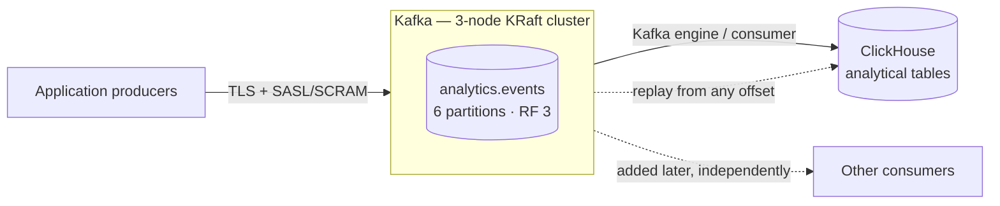
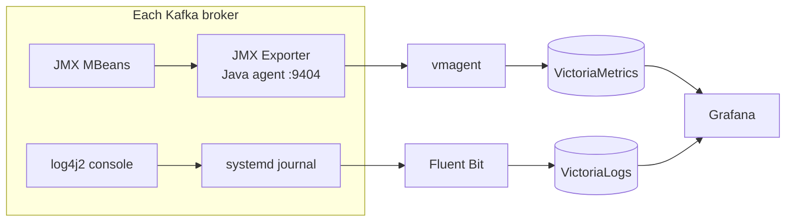

# ansible-role-kafka

A reusable Ansible role that deploys a **vanilla Apache Kafka 4.3.1** cluster in
**KRaft** mode on ordinary Linux hosts, with TLS, SASL/SCRAM authentication,
declarative topic management, and metrics and logs wired into VictoriaMetrics and
VictoriaLogs.

No Confluent Platform. No ZooKeeper. No containers.

> **Deploying or testing this?** Start with the
> **[deployment and testing guide](docs/deployment-guide.md)** — prerequisites,
> the AWS and bring-your-own-hosts routes, deploy, verify, produce/consume,
> idempotency, day-2 operations, teardown and troubleshooting, in order.

## The problem

The platform needs analytics about user activity, landing in ClickHouse. Producers
could write to ClickHouse directly, but then every producer is coupled to
ClickHouse's availability: a restart, a merge storm, or a schema migration turns into
dropped events at the edge of the system, and there is no way to replay them.

Kafka sits between the two as a durable buffer:



What that buys:

- **Buffering.** Producers write at their own rate; ClickHouse reads at its own.
- **Decoupling.** Producers know nothing about consumers.
- **Replay.** Retention is seven days, so a consumer can be rewound after a bad
  deploy or a schema fix.
- **Resilience.** ClickHouse can be down for maintenance without losing events.
- **Scalable ingestion.** Partitions bound consumer parallelism; add partitions and
  consumers together.
- **More consumers later.** A second consumer group costs nothing to add.

### Observability



Metrics go to VictoriaMetrics, logs to VictoriaLogs. This role deploys neither —
`examples/` contains the scrape config and the shipper config to add to the existing
stack.

## Design choices

| Choice | Reasoning |
|---|---|
| **Vanilla Apache Kafka** | No licence surface, no vendor packages, no Confluent-specific configuration to unwind later. |
| **4.3.1, pinned** | Reproducible. `latest` would silently move a cluster across majors on an unrelated re-run. |
| **KRaft, no ZooKeeper** | ZooKeeper is removed entirely in Kafka 4.x. One system to run, operate and secure instead of two. |
| **3 nodes** | Smallest quorum tolerating one node loss. With RF 3 and `min.insync.replicas=2`, `acks=all` producers keep writing through a single failure. |
| **Combined `broker,controller`** | Appropriate at this size — see below. |
| **Java 21** | Supported by Kafka 4.3 and packaged in Ubuntu 24.04 (`openjdk-21-jre-headless`). |
| **systemd, on the host** | Kafka is stateful with a stable identity; see *Why not Docker Swarm*. |
| **AWS is test-only** | The role contains no AWS-specific logic. Terraform exists purely to produce three throwaway Linux boxes to test against. |

### Combined controller/broker nodes

All three nodes run `process.roles=broker,controller`. For a three-node cluster this
is the right trade: dedicated controllers would mean six machines to tolerate the same
single failure, and the metadata workload here is trivial.

**Larger production clusters benefit from dedicated KRaft controllers.** Once brokers
carry real load, co-locating the quorum means a broker's GC pause or page-cache
pressure delays metadata replication, and a broker problem becomes a control-plane
problem. Dedicated controllers isolate the quorum from data-path load, scale
independently of broker count, and shrink the blast radius of a broker incident. The
role supports it: set `kafka_process_roles` per host and put the controllers in their
own inventory group.

## Why not Docker Swarm?

Docker Swarm was considered because it is part of the existing infrastructure stack.
However, Kafka brokers are stateful workloads with persistent local storage and stable
node identity. Automatic Swarm rescheduling provides limited benefit for this workload
and introduces additional complexity around persistent volumes, stable broker identity
and broker networking.

For this assignment Kafka is therefore installed directly on designated Linux hosts
and managed by Ansible and systemd. This keeps broker identity, storage placement,
network addressing and lifecycle management explicit and predictable.

Concretely: a KRaft broker's `node.id` and its formatted metadata directory are bound
together permanently. Rescheduling a broker onto another host without its data
directory does not produce a working broker — it produces a node that has to re-replicate
its entire log, and if the metadata moved without the identity it fails to join the
quorum at all. The orchestration Swarm provides is aimed at workloads that can be moved
freely; this one cannot.

```text
Ansible → Linux hosts → Java + Kafka → systemd
```

## Security

| Layer | Implementation |
|---|---|
| Encryption | TLS on both listeners. No PLAINTEXT listener exists. |
| Internal PKI | Self-signed CA; per-broker key and certificate. |
| Certificate SANs | Hostname, private IP, private DNS, localhost, 127.0.0.1 |
| Client auth | `SASL_SSL` + `SCRAM-SHA-512` on the broker listener |
| Controller auth | `SSL` with mutual TLS (`ssl.client.auth=required`) |
| Principals | `kafka_admin`, `kafka_broker` (inter-broker), `clickhouse` |
| Secrets | Never committed; supplied at runtime |

### Listener design

```text
BROKER      9092   SASL_SSL   SCRAM-SHA-512   clients + inter-broker
CONTROLLER  9093   SSL        mutual TLS      KRaft quorum
```

**Why the controller listener uses mTLS rather than SCRAM.** Kafka stores SCRAM
credentials in the metadata log — and the metadata log is precisely what the controller
quorum exists to replicate. A controller cannot resolve a SCRAM credential until the
quorum it is trying to join is already serving, which is circular. Mutual TLS has no
such dependency: the trust anchor is a file on disk before the process starts. Both
listeners are encrypted and authenticated; neither was weakened to PLAINTEXT to make
configuration easier.

### The SCRAM bootstrap problem

Inter-broker traffic authenticates with SCRAM, but SCRAM credentials live in cluster
metadata, which does not exist until the cluster runs. The role breaks the cycle at
format time:

```text
kafka-storage.sh format --cluster-id … --initial-controllers … \
  --add-scram 'SCRAM-SHA-512=[name="kafka_admin",password=…]' \
  --add-scram 'SCRAM-SHA-512=[name="kafka_broker",password=…]'
```

`kafka_admin` and `kafka_broker` are written into the initial metadata. Every other
principal — `clickhouse` included — is created afterwards with `kafka-configs.sh` over
the authenticated, encrypted listener. There is no PLAINTEXT administration path.

### Why self-signed is acceptable here, and what production does instead

The CA exists to make the cluster's *internal* traffic mutually authenticated between
a fixed, known set of hosts. No browser or third party consumes these certificates, so
a public trust root would add nothing. The CA private key is generated on the Ansible
controller and never copied to a broker; each broker's key is generated on that broker
and never leaves it — only the CSR travels.

Production should integrate the organisation's PKI. The role is built for it:

```yaml
kafka_tls_generate_self_signed: false
kafka_tls_ca_cert_content: "{{ lookup('community.general.infisical', 'kafka/ca_cert') }}"
kafka_tls_cert_content: "{{ lookup(..., 'kafka/' ~ inventory_hostname ~ '/cert') }}"
kafka_tls_key_content: "{{ lookup(..., 'kafka/' ~ inventory_hostname ~ '/key') }}"
```

Nothing else changes — the same templates, the same listeners.

### Secrets and Infisical

`defaults/main.yml` contains no passwords, because it is committed. Credentials and
cluster identity arrive at runtime:

```text
Infisical → Ansible runtime/environment → role variables → secured files (0600/0640)
```

For the ephemeral test environment, `scripts/generate-test-secrets.sh` and
`scripts/generate-cluster-identity.sh` write to gitignored `.local/`. They are written
**once** and reused, because SCRAM passwords must stay stable across runs and the
cluster ID can never change after storage is formatted. Tasks touching credentials use
`no_log: true`.

## Topic management

Topics are declared, not created by accident — `auto.create.topics.enable=false`:

```yaml
kafka_topics:
  - name: analytics.events
    partitions: 6
    replication_factor: 3
    config:
      cleanup.policy: delete
      retention.ms: 604800000      # 7 days
      min.insync.replicas: 2
```

| Situation | Behaviour |
|---|---|
| Topic absent | Created |
| Topic matches | No change |
| More partitions wanted | Increased |
| **Fewer partitions wanted** | **Fails** with an explanation. Kafka cannot decrease a partition count; doing it by delete-and-recreate destroys the data and re-hashes every keyed message onto a different partition, breaking per-key ordering for every consumer. |
| **Replication factor differs** | **Fails** with an explanation. A real change requires `kafka-reassign-partitions.sh`, which moves data between brokers and must be throttled and scheduled. The role will not fake it with `--alter`. |
| Config differs | Reconciled for mutable keys |
| **Removed from `kafka_topics`** | **Nothing.** Deletion is never implicit. |

All topic administration runs over TLS + SASL/SCRAM using the admin configuration.

## ClickHouse

`analytics.events` is the analytics topic. **Six partitions is an initial assumption,
not a workload-derived number.** A real value follows from events/sec, average message
size, required throughput, and the consumer parallelism needed — a consumer group can
never have more active consumers than the topic has partitions. Increasing partitions
later is easy; decreasing is impossible.

The `clickhouse` principal is created for this purpose. Conceptually ClickHouse needs:

```text
bootstrap servers   kafka-1:9092,kafka-2:9092,kafka-3:9092   (private addresses)
security protocol   SASL_SSL
SASL mechanism      SCRAM-SHA-512
username            clickhouse
password            from the secret store — never in Git
CA certificate      the internal CA, so the broker chain validates
```

A Kafka engine table would consume `analytics.events`, and a materialized view would
move rows into a MergeTree table for querying. ClickHouse is **not** deployed by this
role.

## Idempotency

An unchanged run reports `changed=0` and does not restart Kafka.

| Area | How |
|---|---|
| Install | `get_url` with a checksum; `unarchive` with `creates:` |
| KRaft storage | Formatted only when `meta.properties` is absent |
| Cluster identity | Minted once outside the role, never in it |
| PKI | `openssl_privatekey` `regenerate: full_idempotence`; `x509_certificate` compares against the CSR with `ignore_timestamps: true`, so relative validity does not churn serials |
| Config | Templates; a restart fires only on a real diff |
| SCRAM | Existence-checked; Kafka cannot compare a stored credential to a plaintext password, so rotation is explicit (`kafka_scram_force_update`) |
| Topics | State queried first; only genuine differences are applied |

Inspection commands use `changed_when: false`. Mutating commands report their real
state change — nothing is masked to make a run look clean.

## Rolling restarts

`playbooks/kafka.yml` runs two plays. The first converges every node **in parallel**
and, instead of restarting, records that a restart is owed. The second is `serial: 1`
and pays those back one broker at a time, waiting for each to rejoin before touching
the next.

Parallel convergence is required for the initial bootstrap: one node of three cannot
elect a KRaft quorum leader, so a `serial: 1` first run would block forever on its own
health gate. Serialised restarts are required afterwards: with `min.insync.replicas=2`,
two brokers down stops writes.

The health gate is not `systemctl is-active` — that goes green when the JVM starts,
long before the broker is serving. A node is healthy when its port accepts
connections, it answers an authenticated API request, and
`kafka-metadata-quorum describe --status` reports a leader.

```bash
ansible-playbook playbooks/rolling_restart.yml          # all brokers, one at a time
ansible-playbook playbooks/rolling_restart.yml -e kafka_target=kafka-2
```

## Running

Requires `terraform`, `ansible-core`, `python3`, `ssh-keygen`, and AWS credentials.
Full walkthrough, including non-AWS hosts and day-2 operations:
[docs/deployment-guide.md](docs/deployment-guide.md).

```bash
make test-e2e          # the whole chain below, in order
```

Or step by step:

```bash
# 1. Local material (all gitignored, generated once)
./scripts/create-ssh-key.sh
./scripts/generate-test-secrets.sh
./scripts/generate-cluster-identity.sh

# 2. Infrastructure
terraform -chdir=terraform init
terraform -chdir=terraform apply

# 3. Inventory from Terraform outputs
python3 scripts/render-inventory.py

# 4. Dependencies
ansible-galaxy collection install -r requirements.yml

# 5. Deploy, verify, prove idempotency
ansible-playbook playbooks/kafka.yml
ansible-playbook playbooks/verify.yml
ansible-playbook playbooks/kafka.yml        # expect changed=0

# 6. Destroy
terraform -chdir=terraform destroy
rm -rf .local
```

Against non-AWS hosts, skip steps 2 and 3 and write an inventory by hand — see
`examples/inventory.yml`. The role needs only `ansible_host`, `kafka_node_id` and
`kafka_private_ip` per host.

### Linting

```bash
ansible-lint
yamllint .
terraform -chdir=terraform fmt -check -recursive
terraform -chdir=terraform validate
```

CI is deliberately out of scope for this assignment; no workflows are included.

## Repository layout

```text
docs/          deployment guide, architecture, research, test results
examples/      inventory, group_vars, vmagent scrape, Fluent Bit config
playbooks/     kafka.yml, verify.yml, rolling_restart.yml
roles/kafka/   the deliverable — cloud-agnostic
scripts/       key, secrets, cluster identity, inventory rendering, e2e
terraform/     ephemeral AWS test environment only
```

## Production considerations

What this deployment is **not**, stated plainly.

### Sizing

`t3.small` with a 512 MiB heap is an integration-test configuration, **not sizing
guidance**. Real sizing follows from event rate, average message size, retention
period, partition count, replication factor, acceptable consumer lag, network
bandwidth, disk throughput and latency, page cache headroom, and JVM requirements.
Kafka depends heavily on the page cache for consumer reads — leave the majority of
RAM to the OS rather than to the heap.

### Storage

Production Kafka needs appropriately sized persistent disks with adequate IOPS and
throughput, on a dedicated volume rather than the root filesystem. The 30 GiB root
disk here is a test artefact. Monitor free space per log directory; a full log
directory takes the broker offline.

### Failure domains

The three test nodes share one subnet in one availability zone — a deliberate
simplification. Production should distribute brokers across availability zones or
racks where the infrastructure allows, and set `broker.rack` so Kafka spreads replicas
across those domains rather than merely across brokers.

### Controllers

Combined controller/broker nodes suit this size. Dedicated controllers should be
considered as the cluster grows — see *Design choices* above.

### Security

- Enterprise PKI instead of a self-signed CA
- Certificate rotation with a defined lifecycle, and alerting on expiry
- Secret rotation via Infisical rather than statically generated values
- **ACL authorization** (see below)
- Private networking, with brokers unreachable from any public interface
- Least privilege per principal rather than one shared admin

### Authorization

**This implementation enforces authentication, not authorization.** Every principal —
`clickhouse` included — can currently do anything on the cluster, because no
authorizer is configured. Authentication proves who a client is; authorization
constrains what it may do. They are not the same thing and one does not substitute
for the other.

Production should enable `StandardAuthorizer` with `allow.everyone.if.no.acl.found=false`
and grant explicitly: `clickhouse` gets `Read` on `analytics.events` and its consumer
group; producers get `Write` on the topics they own; only an operator principal gets
cluster-level rights. This was left out to keep the assignment within scope, and is a
clear hardening step rather than an oversight.

### Monitoring

Alerts worth defining, with the metric families this role already exposes:

| Alert | Signal |
|---|---|
| Broker unavailable | `up{job="kafka"} == 0` |
| Controller/quorum problem | `kafka_controller_activecontrollercount != 1`, `kafka_raft_*` |
| Offline partitions | `kafka_controller_offlinepartitionscount > 0` |
| Under-replicated partitions | `kafka_server_replicamanager_underreplicatedpartitions > 0` |
| ISR shrink churn | `rate(kafka_server_replicamanager_isrshrinkspersec_total[5m])` |
| Produce/fetch latency | `kafka_network_requestmetrics_totaltimems` percentiles |
| Disk usage | node-level free space per log directory |
| JVM heap pressure | `jvm_memory_heapmemoryusage_used_bytes / …_max_bytes` |
| GC pressure | `rate(jvm_gc_collection_seconds_sum[5m])` |
| Authentication failures | `kafka_server_failed_authentication_total` |
| Certificate expiry | certificate `notAfter`, alerting well before |
| Consumer lag | from consumer group offsets |

Building the alerting platform itself is out of scope.

## Research

Four existing Kafka Ansible roles were reviewed before writing this one —
`confluentinc/cp-ansible`, `idealista/kafka_role`, `s3pweb/ansible-kafka-kraft` and
`sleighzy/ansible-kafka`. Useful patterns were adopted, outdated ones (static
`controller.quorum.voters`, ZooKeeper-era assumptions, quorum membership derived from
the current run's hosts) were rejected. Current Apache Kafka documentation was treated
as the source of truth wherever it and a role disagreed.

The implementation is custom. See **[docs/research.md](docs/research.md)** for the
comparison and decisions, **[docs/architecture.md](docs/architecture.md)** for the
design, and **[docs/test-results.md](docs/test-results.md)** for what was actually
executed — including nine defects the test run surfaced and the fixes for them.

## Licence

MIT. See [LICENSE](LICENSE).
