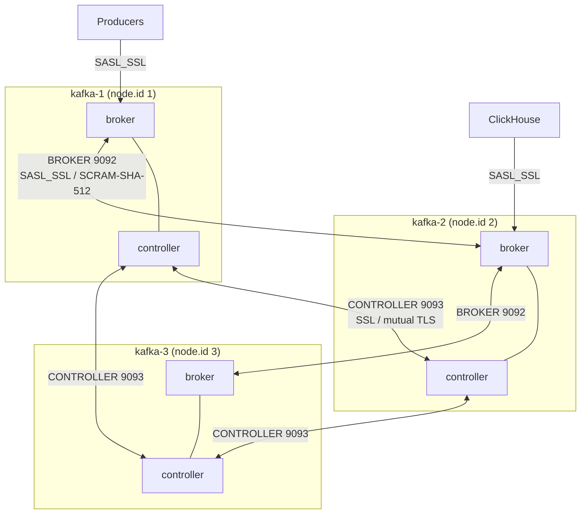
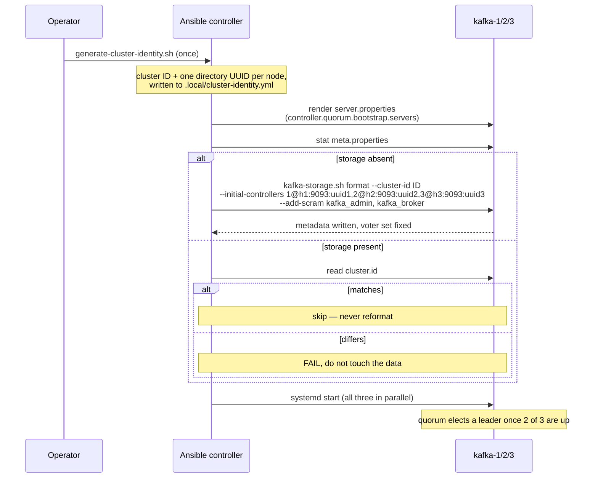
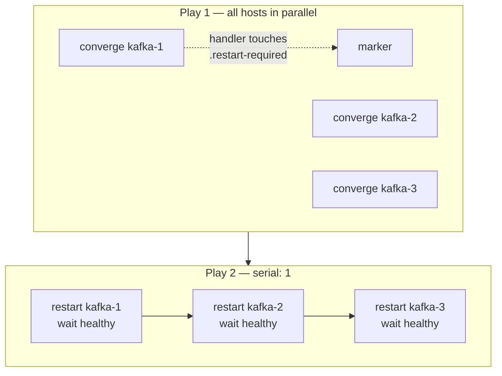

# Architecture

Design and rationale. The README covers the problem and how to run it; this covers
the shape of the system and why it is that shape.

## Topology



Three nodes, each carrying both roles. Every address in the diagram is private; the
public addresses the test environment attaches exist only so Ansible can reach the
boxes over SSH and never appear in `advertised.listeners`.

### Why combined roles here, and when to split

A three-node combined cluster tolerates one node failure for both the data plane
(RF 3, `min.insync.replicas=2`) and the control plane (2-of-3 quorum). Splitting into
dedicated controllers would require six machines to buy the same single-failure
tolerance.

The trade-off reverses under load. A combined node's controller shares a JVM with the
broker, so a broker-side GC pause or page-cache stall delays metadata replication, and
a data-plane problem becomes a control-plane problem. Dedicated controllers isolate
the quorum, scale independently of broker count, and keep a broker incident from
touching cluster metadata. The role supports that split — set `kafka_process_roles`
per host and place controllers in their own inventory group.

## KRaft bootstrap

The hardest part of a KRaft role is that three separate Ansible runs, on three
separate hosts, must agree on values that can never change afterwards.



### Identity is minted outside the role

`kafka_cluster_id` and `kafka_controller_directory_ids` have **no defaults** and the
role asserts they are supplied. This is deliberate. Generating them inside the role
would mean generating them again on the next run, and generating them per host would
mean three hosts inventing three different answers — the quorum would never form.
`scripts/generate-cluster-identity.sh` writes them once to gitignored `.local/`; in
production the same variables come from Infisical.

Every node receives a byte-identical `--initial-controllers` string, and each node
finds its own directory UUID within it by matching `node.id`.

### Dynamic quorum, not static voters

`controller.quorum.bootstrap.servers` is set; `controller.quorum.voters` is never
written anywhere. The Kafka 4.3 configuration reference is explicit that the latter is
"the old way of defining membership for controller quorums and should NOT be set if
using dynamic quorums". The voter set is established once by `--initial-controllers`
at format time and thereafter maintained in the metadata log itself, which is what
makes adding or removing a controller an online operation rather than a
config-and-restart of every node.

Two of the four reference roles surveyed still build a static voter string; one of
them derives it from `ansible_play_hosts`, so running with `--limit` silently rewrites
the cluster's membership. Deriving from the inventory group instead means `--limit`
cannot reshape the cluster.

## Storage safety

Formatting is the one genuinely destructive operation in the role.

1. `stat` `meta.properties` in the first log directory.
2. If absent, format — guarded additionally by `creates:` so the command itself is a
   no-op if the file appears.
3. If present, parse `cluster.id` from it.
4. If that ID differs from the expected one, **fail**. Do not reformat, do not delete
   metadata, do not attempt repair.

Step 4 is the important one. A node carrying a different cluster ID is either a
survivor of a previous cluster or a recycled host, and both cases hold data that a
reformat would destroy. The failure message names the directories and tells the
operator what to check. Automatic recovery here would be a data-loss bug wearing a
convenience feature's clothing.

## Security model

| Listener | Port | Protocol | Authentication | Carries |
|---|---|---|---|---|
| `BROKER` | 9092 | `SASL_SSL` | SCRAM-SHA-512 | client traffic, inter-broker replication |
| `CONTROLLER` | 9093 | `SSL` | mutual TLS | KRaft quorum, broker→controller metadata |

Neither listener is PLAINTEXT, and there is no separate administrative path — the
role's own topic and principal management uses the same `SASL_SSL` listener as
applications.

### Why the controller listener is mTLS

SCRAM credentials are stored in the metadata log. The metadata log is the thing the
controller quorum exists to replicate. So a controller authenticating a peer over
SCRAM would need to read a credential from a log that is not yet being served — it
cannot become available until the quorum forms, and the quorum cannot form until
authentication succeeds.

Mutual TLS has no such ordering problem: the CA certificate and the node's own
keypair are files on disk before the JVM starts. Each broker presents the same
certificate to the controller quorum that it serves to clients, which is why the
certificate carries both `serverAuth` and `clientAuth` extended key usages, and why
`ssl.client.auth=required` is set specifically on the controller listener.

### The SCRAM bootstrap chain

```text
format time   kafka-storage.sh --add-scram   kafka_admin, kafka_broker
              (written into initial metadata, before any broker starts)
                             |
                             v
cluster up    kafka-configs.sh --alter        clickhouse, other applications
              (over SASL_SSL, authenticated as kafka_admin)
```

`kafka_broker` must exist before the first broker starts, because inter-broker
replication authenticates with it. `kafka_admin` is bootstrapped alongside it so the
role has an authenticated identity the moment the cluster is serving.

A subtlety worth recording: the two CLIs quote differently. `kafka-storage.sh
--add-scram` expects `[name="user",password="secret"]`, while `kafka-configs.sh
--add-config` expects `password=secret` **unquoted** and stores the quote characters
verbatim if given them. Applying the wrong form to the admin principal locks the admin
out of its own cluster.

## PKI

```text
Ansible controller                     each broker
──────────────────                     ───────────
CA private key  (never leaves) ──┐
CA certificate ──────────────────┼───> ca.crt        (truststore, 0644)
                                 │
                    CSR <────────┴──── broker private key (generated here,
                     │                  never leaves, 0600, PKCS#8)
                     └── signed ─────> broker.pem    (chain + key, 0600)
```

Each broker generates its own key; only the CSR travels to the controller for
signing. Compromising a broker therefore yields that broker's identity, not the
ability to mint new trusted ones.

SANs cover every name a client might dial: the inventory hostname, the private IP,
the private DNS name, `localhost` and `127.0.0.1`. Omitting any one of them means TLS
verification fails for exactly the clients that use it, which is a confusing failure
to debug because it is per-client rather than global.

**PEM throughout.** Kafka 4.3's default SSL engine reads PEM natively
(`ssl.keystore.type=PEM`), so the role never invokes `keytool` and never produces a
JKS or PKCS#12. This is a correctness decision as much as a simplicity one: `keytool`
rewrites its output on every invocation, so roles built on it either restart Kafka on
every run or hide the churn behind `changed_when: false`.

## Restart model



The two phases exist because bootstrapping and updating have opposite requirements.

**Bootstrap must be parallel.** A single node of three cannot elect a quorum leader,
so its broker never begins serving and its health gate can never pass. A `serial: 1`
first run would block on node 1 forever.

**Updates must be serialised.** With `min.insync.replicas=2`, one broker down still
accepts `acks=all` writes; two down stops them. Restarting all three at once is an
outage.

The restart handler therefore does not restart. It records that a restart is owed by
touching a marker file, and the second play — `serial: 1` — pays those back one node
at a time. The marker is cleared only after the node proves healthy, so a failed
health gate stops the play with the marker intact and a re-run resumes at the same
node rather than moving on and taking a second broker down.

Standalone users of the role who apply it to one host at a time get conventional
behaviour: `kafka_rolling_restart_deferred` defaults to `false`, and the handler
restarts and waits inline.

### What "healthy" means

`systemctl is-active` goes green when the JVM process starts, which is long before
the broker has joined the quorum and begun serving. Using it as a rolling-restart gate
is how a rolling restart takes a cluster down. A node here is healthy when:

1. its broker port accepts TCP connections,
2. `kafka-broker-api-versions.sh` succeeds over `SASL_SSL` with real credentials, and
3. `kafka-metadata-quorum.sh describe --status` reports a `LeaderId`.

All three are read-only and marked `changed_when: false`.

## Observability

**Metrics.** The Prometheus JMX Exporter runs as an in-process Java agent
(`-javaagent:…=<private-ip>:9404:<config>`), bound to the private address only. No
remote JMX or RMI port is opened — which required explicitly overriding
`KAFKA_JMX_OPTS`, because `bin/kafka-run-class.sh` otherwise substitutes a default
that enables JMX with `authenticate=false` and `ssl=false`.

The rule set is deliberately short. Mirroring every Kafka MBean produces tens of
thousands of series per broker, and that cost lands on VictoriaMetrics. The rules
cover replication health, quorum state, throughput, request latency, thread-pool
saturation, authentication failures and the JVM — the signals an alert actually fires
on.

**Logs.** Kafka logs to stdout; systemd captures it; `journalctl -u kafka` is the
single operational source. The role ships a console-only `log4j2.yaml` rather than
using the stock one, because Kafka's shipped configuration attaches the controller,
authorizer, request and log-cleaner loggers to their own rolling files with
`additivity: false` — so with the default config the journal is missing precisely the
controller and authorizer records an incident needs.

## Cloud-agnosticism

`roles/kafka/` contains no AWS-specific logic, no cloud modules and no provider
credentials. It needs three facts per host, all from the inventory:

```yaml
ansible_host:      how Ansible reaches the box
kafka_node_id:     the KRaft node.id — unique and permanent
kafka_private_ip:  the address Kafka binds and advertises
```

Everything else has a default. `terraform/` is test scaffolding that produces three
Ubuntu boxes and an inventory; it is not part of the deliverable. The same role runs
unchanged against OVH, DigitalOcean, Cherry Servers or bare metal with a hand-written
inventory — see `examples/inventory.yml`.
